# Avenue JOAILLERIE ERP — Full Flow Documentation

This guide walks through the complete shop + manufacturing workflow, with screenshots from a live session at `http://localhost:3000`.

**Start the app:** run `START.bat` (or `npm run dev`), then open the browser URL shown.

---

## 1. System overview

Avenue JOAILLERIE ERP covers stock, manufacturing, sales, purchasing, and double-entry accounting in one place.

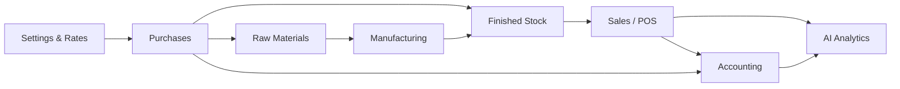

| Area | What it does |
|------|----------------|
| **Dashboard** | Today/month revenue, metal rates, recent sales, low stock |
| **AI Analytics** | Best collections, staff, slow stock, repeat buyers |
| **Finished Stock** | Sellable jewellery (gold / diamond filters) |
| **Raw Materials** | Bullion, stones, findings |
| **Manufacturing** | Job cards → issue metal to karigars → finished pieces |
| **Sales / POS** | Retail, gold, and diamond sales + returns |
| **Purchases** | Raw and finished stock POs |
| **Accounting** | Journals, P&L, balance sheet, ledgers |
| **Settings** | Company name, logo, currency, tax ID |

---

## 2. Dashboard

**Path:** `/`

Central live view of revenue, stock count, open jobs, metal rates, recent invoices, and low-stock alerts.

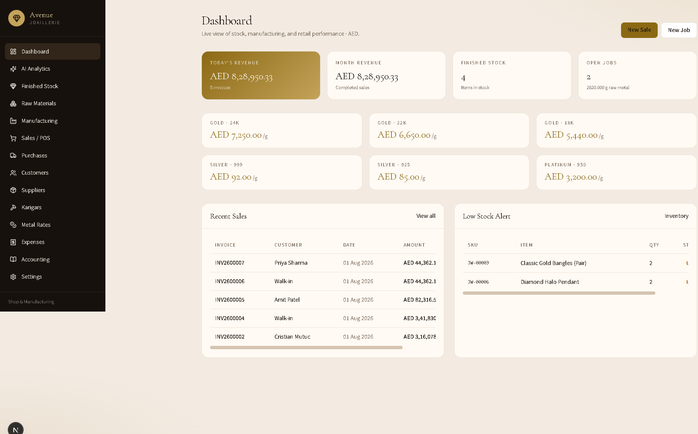

**Typical actions**

1. Check **Today’s Revenue** and **Month Revenue**.
2. Confirm metal rates before selling.
3. Click **New Sale** or **New Job**, or open a recent invoice.

---

## 3. Company settings (do this first)

**Path:** `/settings`

Set shop identity used on invoices and printed reports: name, address, email, phone, tax number, currency, logo, default making % and wastage %.

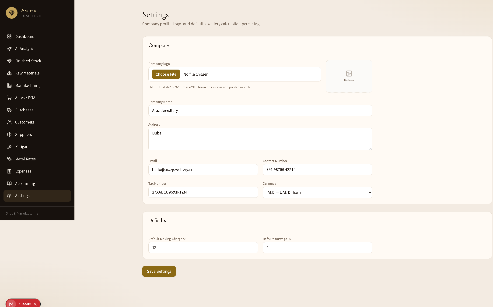

**Recommended setup**

1. Set **Company Name** to `Avenue JOAILLERIE`.
2. Choose **Currency** (e.g. AED).
3. Upload a **Company logo** (shown on invoices).
4. Click **Save Settings**.

> If invoices still show an old name, update and save Settings — the database value overrides code defaults.

---

## 4. Stock flows

### 4.1 Finished stock

**Path:** `/inventory`

Sellable pieces with diamond / gold / all filters, search, edit, and delete.

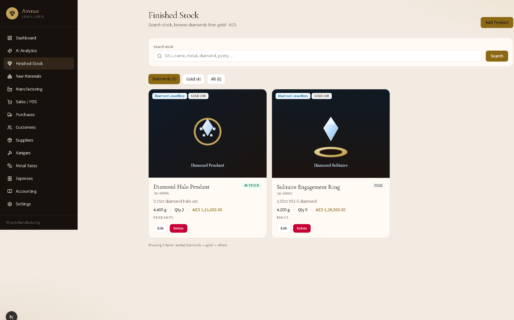

**Add a product**

1. Click **Add Product**.
2. Choose jewellery category (**Gold** or **Diamond**).
3. Enter SKU details, weights, making, prices, photo.
4. Save — item appears in Finished Stock and can be sold or purchased into.

### 4.2 Raw materials

**Path:** `/materials`

Bullion, stones, and findings used by manufacturing and raw purchases.

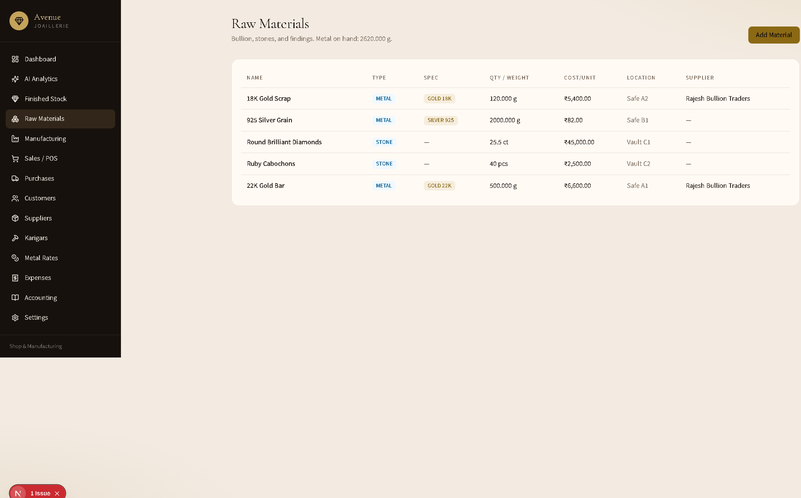

---

## 5. Purchase flow

**Path:** `/purchases` → **New Purchase**

Buy raw metal/materials **or** finished stock. Receiving finished stock increases inventory quantity.

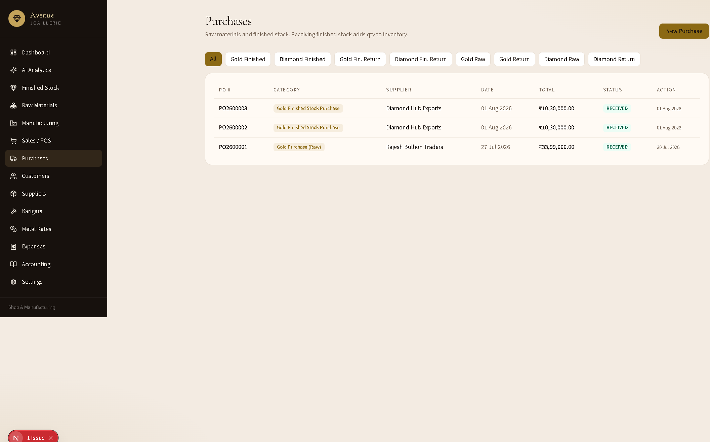

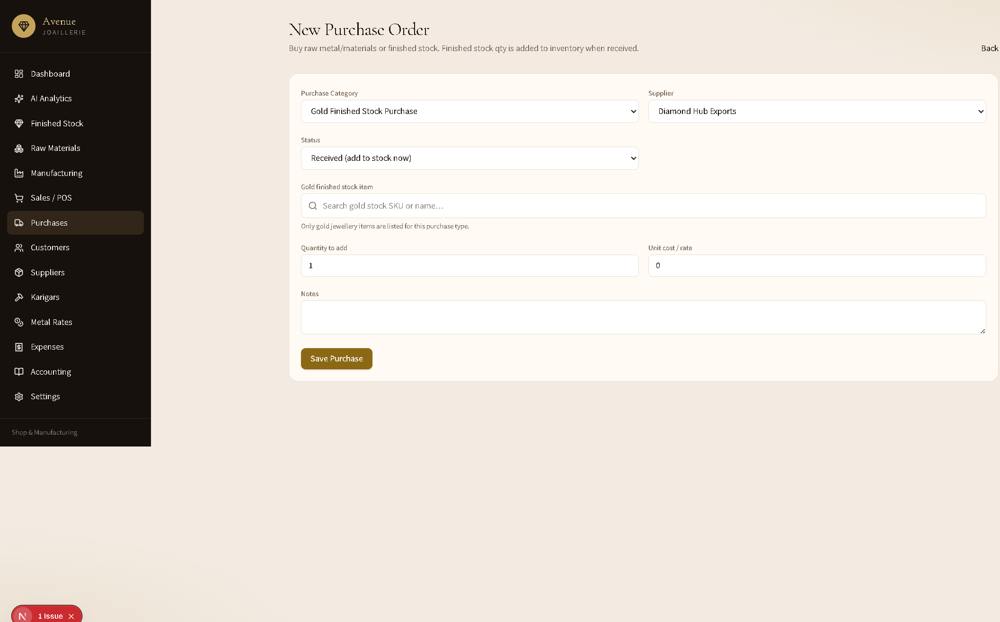

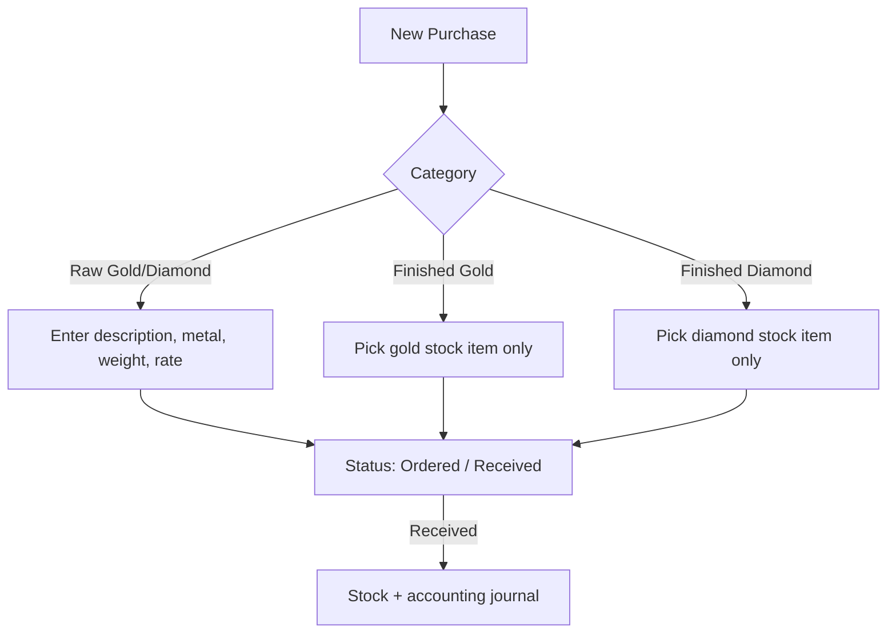

**Steps**

1. Open **Purchases** → **New Purchase**.
2. Choose **Purchase Category**:
   - **Gold / Diamond Purchase (Raw)** — materials ledger.
   - **Gold / Diamond Finished Stock Purchase** — product picker filtered to that jewellery type.
3. Select supplier and status (**Received** adds stock immediately).
4. For finished stock: search and select the product, qty, and unit cost.
5. **Save Purchase** → PO created; if received, qty and journal post automatically.

---

## 6. Manufacturing flow

**Path:** `/manufacturing`

Issue metal to karigars, track labour, and receive finished pieces into stock.

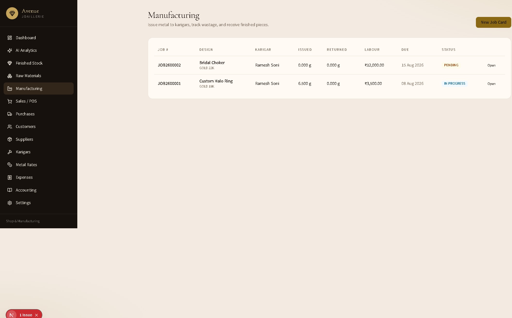

**Steps**

1. Click **New Job Card**.
2. Describe the design, metal, karigar, due date, labour.
3. Issue raw metal weight from materials.
4. When complete, receive the finished piece (creates / updates finished stock).

---

## 7. Sales / POS flow

**Path:** `/sales` → **New Sale** → invoice detail

### 7.1 Sales list

Filter by **Retail**, **Gold**, **Diamond** (and returns). Edit or delete invoices; stock and journals reverse on delete/edit.

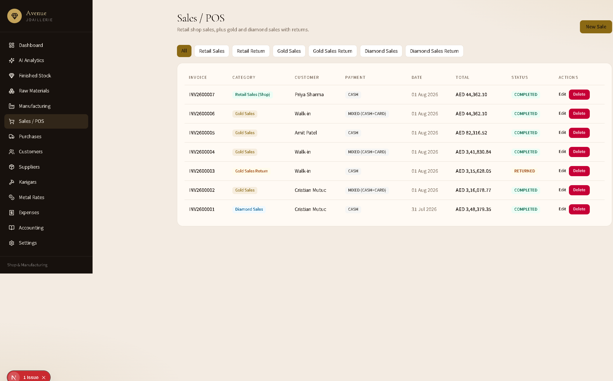

### 7.2 Create a sale

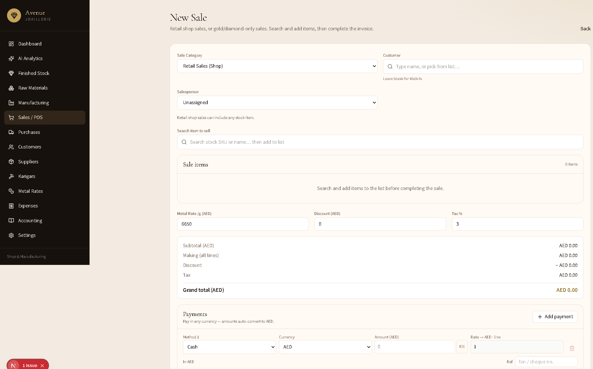

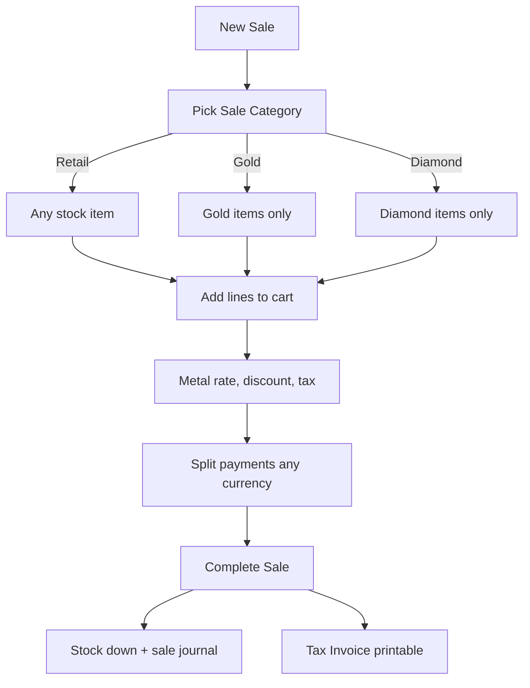

**Steps**

1. Choose **Sale Category**:
   - **Retail Sales (Shop)** — any stock (default).
   - **Gold Sales** — gold jewellery only.
   - **Diamond Sales** — diamond jewellery only.
2. Customer: type a name or pick from the list (blank = Walk-in).
3. Assign a **Salesperson** (powers AI staff ranking).
4. Search SKU/name → add one or more lines; adjust weight, making, stone, qty.
5. Set metal rate /g, discount, tax %.
6. Enter **Payments** (cash/card/UPI/bank; multi-currency converts to shop currency).
7. **Complete Sale** → invoice created, stock reduced, accounting posted.

### 7.3 Tax invoice

Printable invoice with company header, line items, payments, and salesperson.

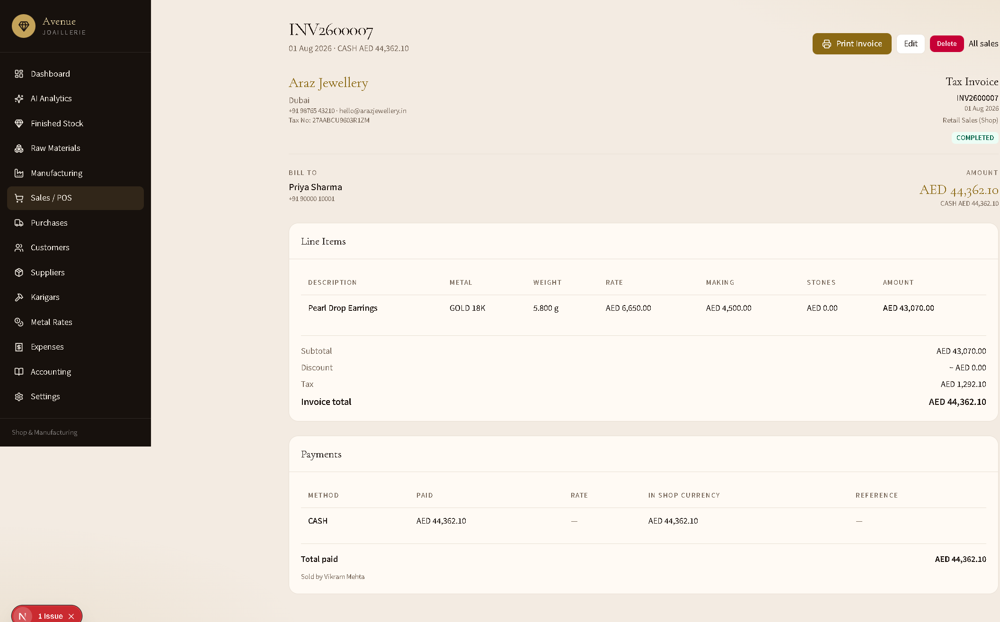

Use **Print Invoice**, **Edit**, or **Delete** from this page.

---

## 8. Accounting flow

**Path:** `/accounting`

Books sync from sales, purchases, and expenses. Hub shows P&L snapshot, trial balance status, assets/liabilities, and links to reports.

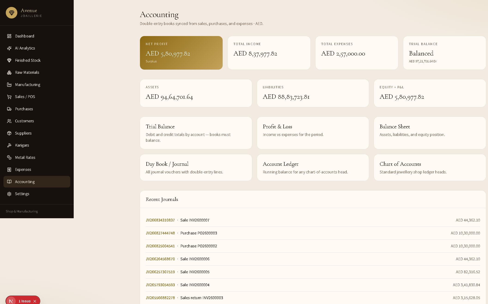

| Report | Purpose |
|--------|---------|
| Trial Balance | Debits = credits check |
| Profit & Loss | Income vs expenses |
| Balance Sheet | Assets, liabilities, equity |
| Day Book / Journal | All vouchers |
| Account Ledger | Running balance per head |
| Chart of Accounts | Standard jewellery ledger codes |

Sales post to finished-goods / income / cash-bank / GST as applicable; finished purchases hit finished inventory (`INV_FG`), raw purchases hit raw materials (`INV_RM`).

---

## 9. AI Sales Analytics

**Path:** `/analytics`

Answers the four business questions with date-filtered data and narrative insights.

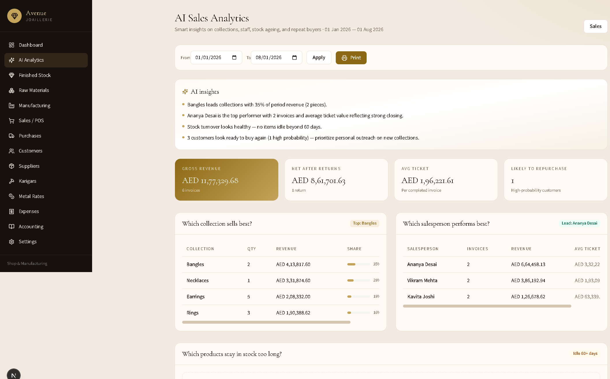

| Question | What you see |
|----------|----------------|
| **Which collection sells best?** | Revenue, qty, and share by category (e.g. Bangles, Rings) |
| **Which salesperson performs best?** | Invoices, revenue, average ticket |
| **Which products stay in stock too long?** | Idle 60+ days, risk high/medium, tied value |
| **Which customers are likely to buy again?** | RFM-style score (high / medium) + win-back list |

1. Set **From / To** → **Apply**.
2. Read **AI insights** at the top.
3. Use tables for outreach, markdowns, or staff coaching.
4. Optional **Print** for a period pack.

---

## 10. End-to-end “happy path”

1. **Settings** — company name `Avenue JOAILLERIE`, currency, logo.
2. **Metal Rates** — set today’s gold/silver/platinum rates.
3. **Suppliers / Customers / Karigars** — master data.
4. **Purchase** finished or raw stock → receive.
5. Optional **Manufacturing** job → finished piece in stock.
6. **New Sale** (Retail / Gold / Diamond) → multi-item cart → payments → complete.
7. **Print invoice** for the customer.
8. **Accounting** — confirm journals / P&L.
9. **AI Analytics** — review collections, staff, ageing stock, repeat buyers.

---

## 11. Screenshot index

| File | Screen |
|------|--------|
| `screenshots/01-dashboard.png` | Dashboard |
| `screenshots/02-analytics.png` | AI Sales Analytics |
| `screenshots/03-inventory.png` | Finished Stock |
| `screenshots/04-sales.png` | Sales list |
| `screenshots/05-new-sale.png` | New Sale |
| `screenshots/06-purchases.png` | Purchases list |
| `screenshots/07-new-purchase.png` | New Purchase |
| `screenshots/08-manufacturing.png` | Manufacturing |
| `screenshots/09-accounting.png` | Accounting hub |
| `screenshots/10-settings.png` | Settings |
| `screenshots/11-materials.png` | Raw Materials |
| `screenshots/12-invoice.png` | Tax Invoice |

All images live under [`docs/screenshots/`](screenshots/).

---

## 12. Quick reference — sale & purchase categories

**Sales:** `RETAIL_SALE` / `RETAIL_RETURN` · `GOLD_SALE` / `GOLD_RETURN` · `DIAMOND_SALE` / `DIAMOND_RETURN`

**Purchases:** raw gold/diamond · finished gold/diamond purchase & return

Item pickers always match the selected jewellery type (retail sales show all stock).
